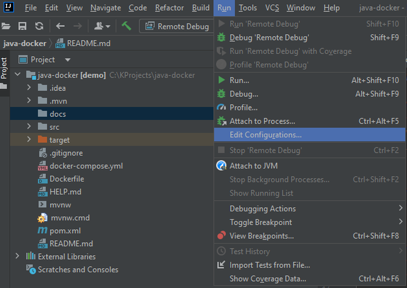
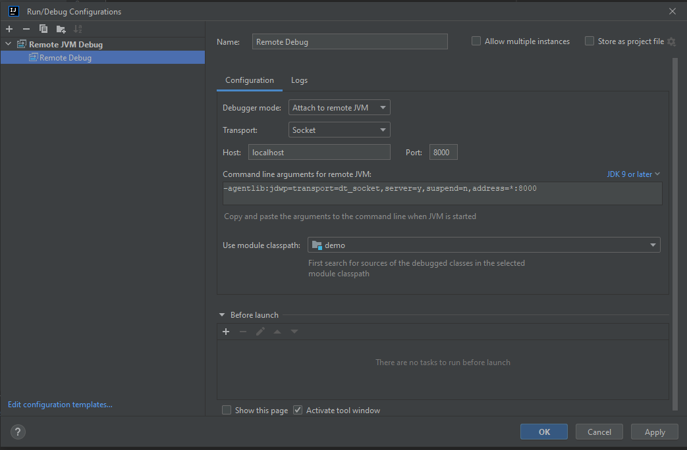

# Demo Application to demonstrate using Docker during Development

## Prerequisites
1. Docker Desktop for Windows
2. Windows Subsystem for Linux
3. IntelliJIDEA Community Edition

## Using `Spring Initializer Website`
Using [Spring Iinitializer](https://start.spring.io/) create the java spring boot project as shown in the below image.

## Using `Spring CLI`

If you want to use CLI to create your spring application instead of initializer website as shown at the beginning then,
install SDKMAN as below.
1. `curl -s "https://get.sdkman.io" | bash`
2. `source "~/.sdkman/bin/sdkman-init.sh"`
3. `sdk install springboot`
4. `spring init --dependencies=web java-docker --build=maven`
5. `cd java-docker/`
6. `sudo ./mvnw spring-boot:run`

Now in the `wsl` terminal, run the following commands
a. `sudo apt-get update`
b. `sudo apt-get install apt-transport-https ca-certificates curl gnupg lsb-release`

## Commands used to build `Docker` image using Dockerfile
1. `sudo docker build --tag java-docker .`
2. `sudo docker run -d -p 8080:8080 java-docker`

## Commands used to build Docker image using `docker-compose.yml` file
1. `sudo  docker compose build --no-cache java-docker`
2. `sudo docker compose up –d`

## Remote JVM Debug Configuration

Choose `Run > Debug “Attach to Remote Program”`. Now make changes to the message in the REST api.
Then choose `Build> Rebuild Module “idg-java-docker”`
